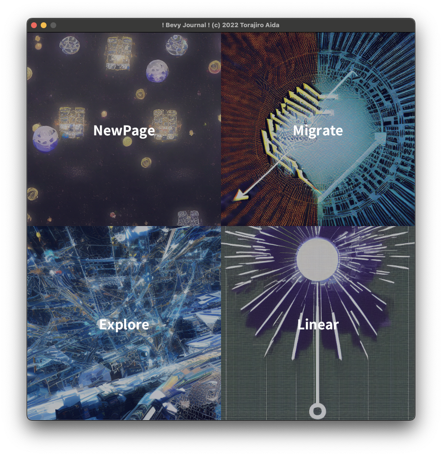
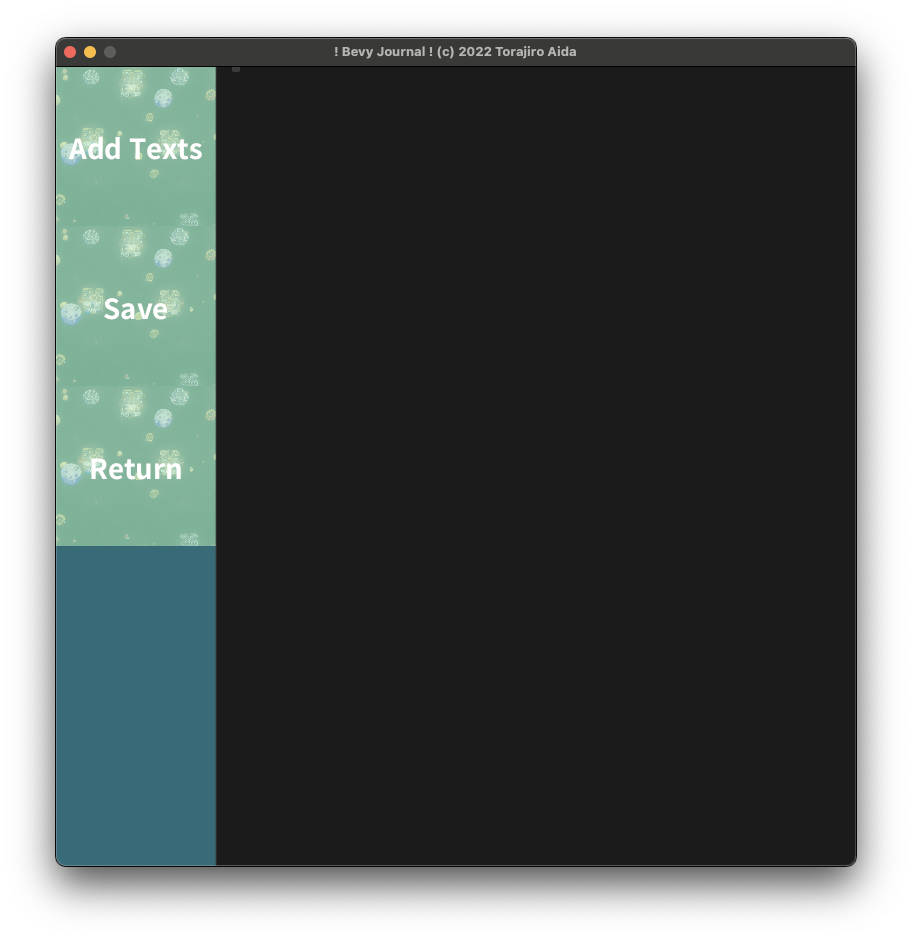
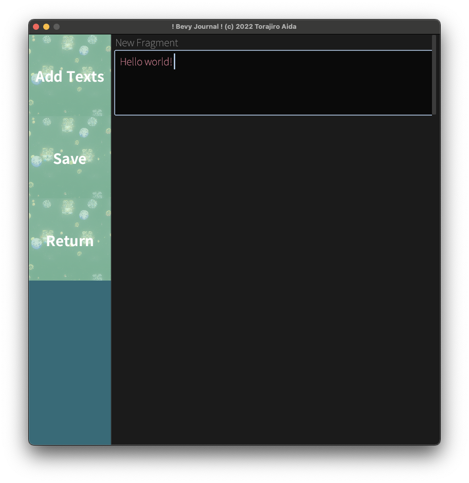
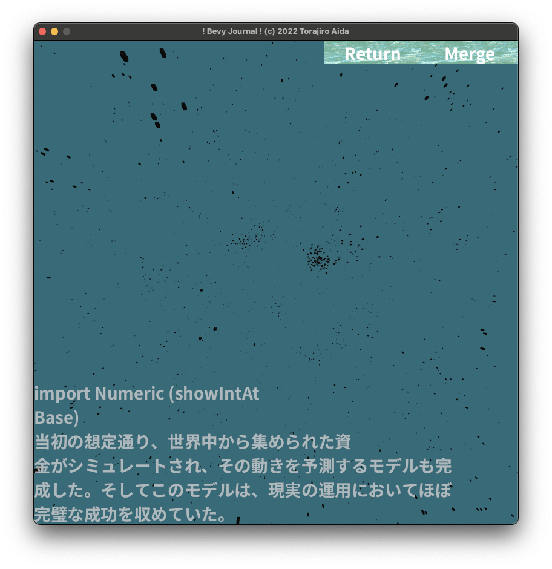
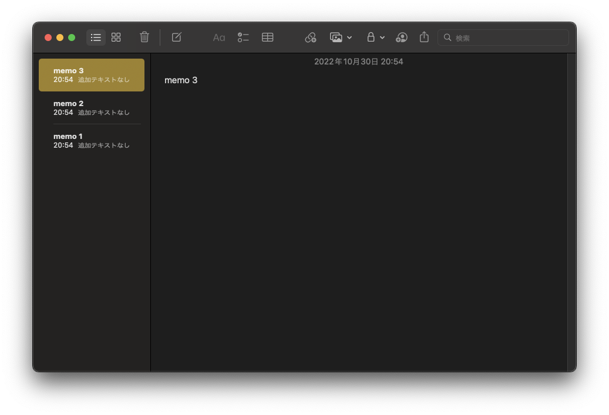

# Closer look at the app's features

In this chapter, I will introduce several main features of the app. After the player [^pl] opens the app, a window will pop up as the picture below.

  

There are four buttons on the start page. After clicking these buttons, you will jump to another page.

## New Page: Writing a new note entry - 70% completed

After clicking "NewPage" button, the player will see a screen like below:

  

In this page, you can create a new note. Firstly, pressing "Add Texts" will yield a textbox in the right grey pane. 

  

In this app, a note should be separated in smaller pieces (called "fragments") to allow rearrangement or recombination of notes thereafter. [^tx] To help this, if you type consecutive two newlines, it will produce another textbox below.

The future plan is to allow the player to split, merge, and tag fragments. Also, I should develop a feature to import images.

## Saving/Loading note data - 100% completed

After finish writing, you can press the "Save" button to save changes. Instantly, the app will save all the note data to "state.scn.ron" file, using Bevy's "scene" feature. At first it was very buggy, but now it's completely fine.

## Explore: Non-linear exploration of notes - 40% completed

Through "Explore" page, the player can explore inside the complex entangling of notes. Each fragment is visualized as a black cube, and its relationships (e.g. A is modified from B, or A is right after B) is visualized as a graph. You can see in the picture that related cubes make clusters.

  

Future plan is to show edges, more understandable visualization, and use musics/sounds/text-to-speech feature.

## Migrate: Importing data from other services (e.g. Facebook) - 60% completed

Although it doesn't have GUI, you can import Facebook posts and comments by drag-and-dropping the backup data from Facebook.

## Linear: Linear exploration of notes  - 0% completed

I'm planning to implement "linear" experiment like a normal note-taking applications, because this way, it is easier to search for certain memos.

  
Screenshot of Apple's Note App

[^pl]: I'll call users "players" from now on.

[^tx]: Each fragment corresponds to a textbox.